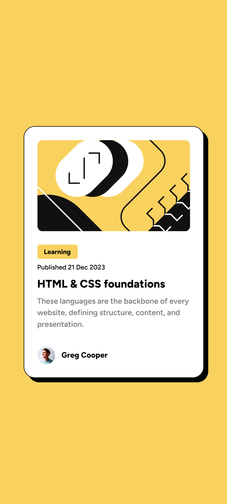

# Frontend Mentor - Blog preview card solution

This is a solution to the [Blog preview card challenge on Frontend Mentor](https://www.frontendmentor.io/challenges/blog-preview-card-ckPaj01IcS). Frontend Mentor challenges help you improve your coding skills by building realistic projects. 

## Table of contents

- [Overview](#overview)
  - [The challenge](#the-challenge)
  - [Screenshot](#screenshot)
  - [Links](#links)
- [My process](#my-process)
  - [Built with](#built-with)
  - [What I learned](#what-i-learned)
- [Author](#author)

## Overview

### The challenge

Users should be able to:

- See hover and focus states for all interactive elements on the page

### Screenshot

#### Desktop

#### Mobile

### Links

- Solution URL: [Add solution URL here](https://your-solution-url.com)
- Live Site URL: [Add live site URL here](https://kunwar91.github.io/fe-mentors_blog-preview-card/)

## My process

- updated index.html with semantic tags like main, p, h2, etc...
- used tailwind css for styling
- applied mobile first approach so no media queries were required to make the site responsive

### Built with

- Semantic HTML5 markup
- [Tailwind CSS](https://tailwindcss.com/) - CSS framework
- Flexbox
- Mobile-first workflow

### What I learned

Styling using Tailwind CSS 

## Author

- Website - [Kunwar](https://www.your-site.com)
- Frontend Mentor - [@kunwar91](https://www.frontendmentor.io/profile/kunwar91)
- Twitter - [@kps91](https://twitter.com/kps91)